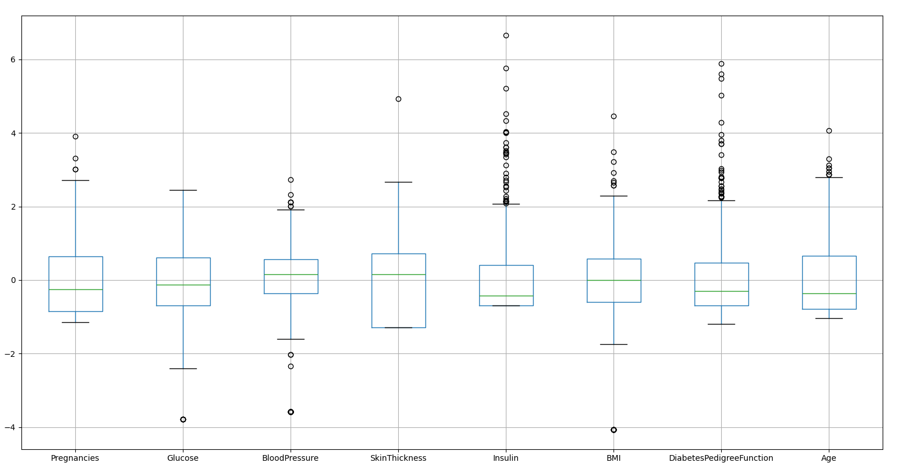
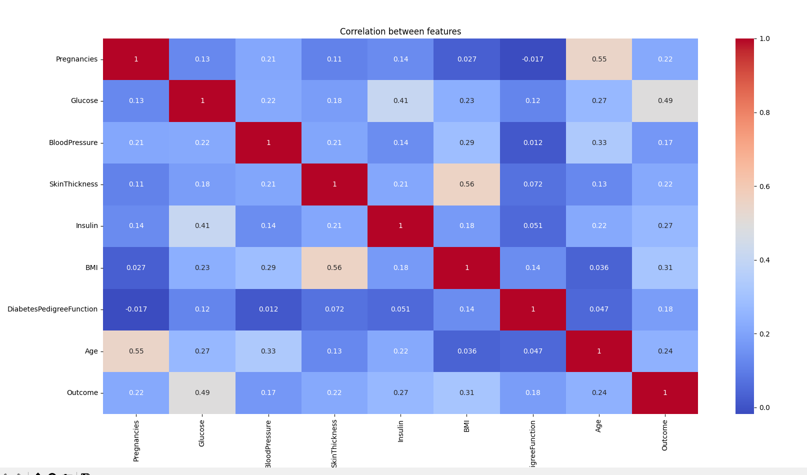
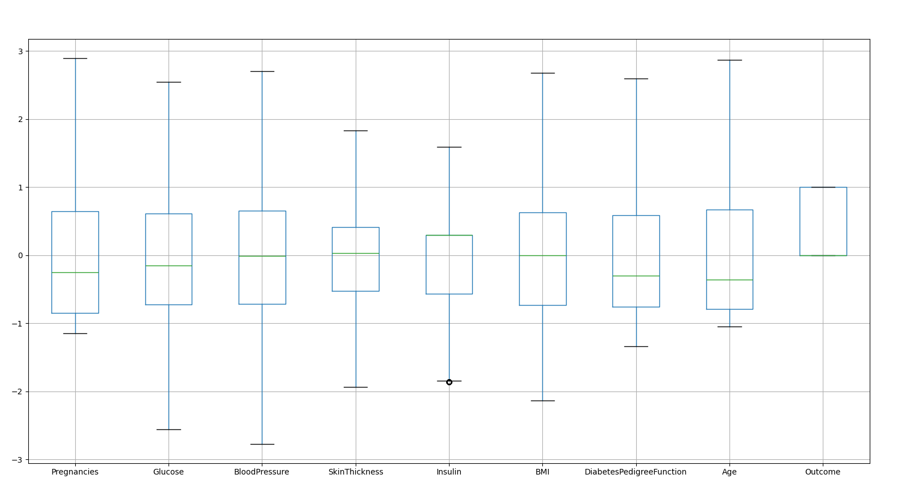

Data info: Data shape: (768, 9)

RangeIndex: 768 entries, 0 to 767
Data columns (total 9 columns):
#   Column                    Non-Null Count  Dtype
---  ------                    --------------  -----
0   Pregnancies               768 non-null    int64
1   Glucose                   768 non-null    int64
2   BloodPressure             768 non-null    int64
3   SkinThickness             768 non-null    int64
4   Insulin                   768 non-null    int64
5   BMI                       768 non-null    float64
6   DiabetesPedigreeFunction  768 non-null    float64
7   Age                       768 non-null    int64
8   Outcome                   768 non-null    int64
~~~~~~~~~~~~~~~~~~~~~~~~~~~~~~~~~~~~~~~~~~~~~~~~~~~~~~~~~~~~~~~~~~~~~~~~~~~~~~~~~~~~~~~~~~~~~~~~~~~~~~~~~~~~~~~~~~~~~~~~~~~~~~~~~~~~~~
Description of the data (before preprocessing):

       Pregnancies     Glucose  BloodPressure  SkinThickness     Insulin         BMI  DiabetesPedigreeFunction         Age     Outcome
count   768.000000  768.000000     768.000000     768.000000  768.000000  768.000000                768.000000  768.000000  768.000000
mean      3.845052  120.894531      69.105469      20.536458   79.799479   31.992578                  0.471876   33.240885    0.348958
std       3.369578   31.972618      19.355807      15.952218  115.244002    7.884160                  0.331329   11.760232    0.476951
min       0.000000    0.000000       0.000000       0.000000    0.000000    0.000000                  0.078000   21.000000    0.000000
25%       1.000000   99.000000      62.000000       0.000000    0.000000   27.300000                  0.243750   24.000000    0.000000
50%       3.000000  117.000000      72.000000      23.000000   30.500000   32.000000                  0.372500   29.000000    0.000000
75%       6.000000  140.250000      80.000000      32.000000  127.250000   36.600000                  0.626250   41.000000    1.000000
max      17.000000  199.000000     122.000000      99.000000  846.000000   67.100000                  2.420000   81.000000    1.000000
~~~~~~~~~~~~~~~~~~~~~~~~~~~~~~~~~~~~~~~~~~~~~~~~~~~~~~~~~~~~~~~~~~~~~~~~~~~~~~~~~~~~~~~~~~~~~~~~~~~~~~~~~~~~~~~~~~~~~~~~~~~~~~~~~~~~~~
First 5 samples (before preprocessing):

   Pregnancies  Glucose  BloodPressure  SkinThickness  Insulin   BMI  DiabetesPedigreeFunction  Age  Outcome
0            6      148             72             35        0  33.6                     0.627   50        1
1            1       85             66             29        0  26.6                     0.351   31        0
2            8      183             64              0        0  23.3                     0.672   32        1
3            1       89             66             23       94  28.1                     0.167   21        0
4            0      137             40             35      168  43.1                     2.288   33        1
~~~~~~~~~~~~~~~~~~~~~~~~~~~~~~~~~~~~~~~~~~~~~~~~~~~~~~~~~~~~~~~~~~~~~~~~~~~~~~~~~~~~~~~~~~~~~~~~~~~~~~~~~~~~~~~~~~~~~~~~~~~~~~~~~~~~~~
~~~~~~~~~~~~~~~~~~~~~~~~~~~~~~~~~~~~~~~~~~~~~~~~~~~~~~~~~~~~~~~~~~~~~~~~~~~~~~~~~~~~~~~~~~~~~~~~~~~~~~~~~~~~~~~~~~~~~~~~~~~~~~~~~~~~~~
Processing Steps:

    - removed zero values from columns where it is impossible to occur SkinThickness = 0 XD

    - clipped extreme outliers (beyond whiskers) to whiskers, age = 762 :0

    - standerdized all values to give equal effect to all values, cause
        before some values would range from 0,0.5 and others from 0 to 100 like age
        standardization would give all paramaters equal effect (plus data already follows a gaussian distribution)
~~~~~~~~~~~~~~~~~~~~~~~~~~~~~~~~~~~~~~~~~~~~~~~~~~~~~~~~~~~~~~~~~~~~~~~~~~~~~~~~~~~~~~~~~~~~~~~~~~~~~~~~~~~~~~~~~~~~~~~~~~~~~~~~~~~~~~
Description of the data (after processing):

       Pregnancies   Glucose  BloodPressure  SkinThickness   Insulin       BMI  DiabetesPedigreeFunction       Age  Outcome
count     7.68e+02  7.68e+02       7.68e+02       7.68e+02  7.68e+02  7.68e+02                  7.68e+02  7.68e+02   768.00
mean     -6.25e-17 -3.49e-16       3.17e-16       2.75e-16 -4.14e-16  7.33e-16                 -2.10e-16  2.17e-16     0.35
std       1.00e+00  1.00e+00       1.00e+00       1.00e+00  1.00e+00  1.00e+00                  1.00e+00  1.00e+00     0.48
min      -1.15e+00 -2.55e+00      -2.77e+00      -1.94e+00 -1.86e+00 -2.13e+00                 -1.33e+00 -1.05e+00     0.00
25%      -8.49e-01 -7.21e-01      -7.17e-01      -5.26e-01 -5.68e-01 -7.35e-01                 -7.54e-01 -7.92e-01     0.00
50%      -2.51e-01 -1.54e-01      -1.49e-02       3.25e-02  2.94e-01  6.58e-04                 -3.03e-01 -3.61e-01     0.00
75%       6.47e-01  6.10e-01       6.52e-01       4.15e-01  2.94e-01  6.31e-01                  5.86e-01  6.71e-01     1.00
max       2.89e+00  2.54e+00       2.71e+00       1.83e+00  1.59e+00  2.68e+00                  2.60e+00  2.87e+00     1.00
~~~~~~~~~~~~~~~~~~~~~~~~~~~~~~~~~~~~~~~~~~~~~~~~~~~~~~~~~~~~~~~~~~~~~~~~~~~~~~~~~~~~~~~~~~~~~~~~~~~~~~~~~~~~~~~~~~~~~~~~~~~~~~~~~~~~~~
First 5 samples (after processing):

Pregnancies  Glucose  BloodPressure  SkinThickness  Insulin   BMI  DiabetesPedigreeFunction   Age  Outcome
0         0.65     0.87          -0.03           0.82     0.29  0.18                      0.59  1.45        1
1        -0.85    -1.21          -0.55           0.01     0.29 -0.87                     -0.38 -0.19        0
2         1.25     2.02          -0.72           0.03     0.29 -1.37                      0.75 -0.10        1
3        -0.85    -1.07          -0.55          -0.79    -1.27 -0.64                     -1.02 -1.05        0
4        -1.15     0.50          -2.77           0.82     0.61  1.61                      2.60 -0.02        1
~~~~~~~~~~~~~~~~~~~~~~~~~~~~~~~~~~~~~~~~~~~~~~~~~~~~~~~~~~~~~~~~~~~~~~~~~~~~~~~~~~~~~~~~~~~~~~~~~~~~~~~~~~~~~~~~~~~~~~~~~~~~~~~~~~~~~~
Correlation between diffrent paramaters:

                          Pregnancies   Glucose  BloodPressure  SkinThickness   Insulin       BMI  DiabetesPedigreeFunction       Age   Outcome
Pregnancies                  1.000000  0.126554       0.210813       0.111916  0.135038  0.027166                 -0.017398  0.549695  0.220392
Glucose                      0.126554  1.000000       0.219611       0.181809  0.411099  0.233488                  0.118189  0.268535  0.492928
BloodPressure                0.210813  0.219611       1.000000       0.205212  0.140558  0.286554                  0.011915  0.332547  0.169333
SkinThickness                0.111916  0.181809       0.205212       1.000000  0.210714  0.558800                  0.071534  0.127244  0.220572
Insulin                      0.135038  0.411099       0.140558       0.210714  1.000000  0.175615                  0.050695  0.219945  0.266135
BMI                          0.027166  0.233488       0.286554       0.558800  0.175615  1.000000                  0.138290  0.035610  0.312693
DiabetesPedigreeFunction    -0.017398  0.118189       0.011915       0.071534  0.050695  0.138290                  1.000000  0.047289  0.184969
Age                          0.549695  0.268535       0.332547       0.127244  0.219945  0.035610                  0.047289  1.000000  0.242702
Outcome                      0.220392  0.492928       0.169333       0.220572  0.266135  0.312693                  0.184969  0.242702  1.000000
~~~~~~~~~~~~~~~~~~~~~~~~~~~~~~~~~~~~~~~~~~~~~~~~~~~~~~~~~~~~~~~~~~~~~~~~~~~~~~~~~~~~~~~~~~~~~~~~~~~~~~~~~~~~~~~~~~~~~~~~~~~~~~~~~~~~~~
Spliting data:

    - split data using starta method to maintain an equal distribution of similer Outcome

IMPORTANT:

spliting function returns a pandas train and test
~~~~~~~~~~~~~~~~~~~~~~~~~~~~~~~~~~~~~~~~~~~~~~~~~~~~~~~~~~~~~~~~~~~~~~~~~~~~~~~~~~~~~~~~~~~~~~~~~~~~~~~~~~~~~~~~~~~~~~~~~~~~~~~~~~~~~~
BEFORE PROCESSING:

AFTER PROCESSING:

